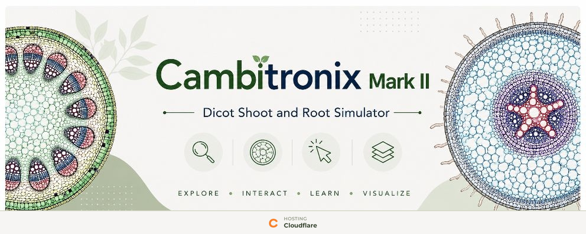

  

# 🌿 Cambitronix MK II

### *Interactive Plant Anatomy Simulator*

> **Cambitronix** is an interactive visualization exploring the internal anatomy of **dicot stems and roots** through transverse sections, tissue systems, and microscope-inspired botanical illustrations.
>
> 🌿 **Plant Anatomy** · 🔬 **Botany** · 🧬 **Plant Tissue Systems**

**🔬 [Explore the Simulation](YOUR-LINK-HERE)**

---

## ✦ Features

**🌱 Interactive Anatomy**  
Explore transverse sections of **dicot stems and roots** through interactive anatomical visualizations.

**🔬 Tissue System Visualization**  
Identify dermal, ground, and vascular tissue systems through intuitive visual organization.

**🌿 Microscope-Inspired Graphics**  
Explore detailed botanical illustrations inspired by textbook and laboratory observations.

**📚 Educational Visualization**  
Explore plant anatomy through concepts aligned with **NCERT Biology** and biological accuracy.

**📱 Responsive Design**  
Optimized for modern desktop, tablet, and mobile devices.

---

## 🧬 Core Concepts

**Dicot Stem · Dicot Root · Tissue Systems · Xylem · Phloem · Plant Anatomy · Transverse Sections**

---

## ⚙️ Technology

**HTML · CSS · JavaScript**

**Repository:** GitHub & Codeberg  
**Hosting:** Cloudflare

---

## 📜 License

Distributed under the **GNU General Public License v3.0 (GPL-3.0)**.
